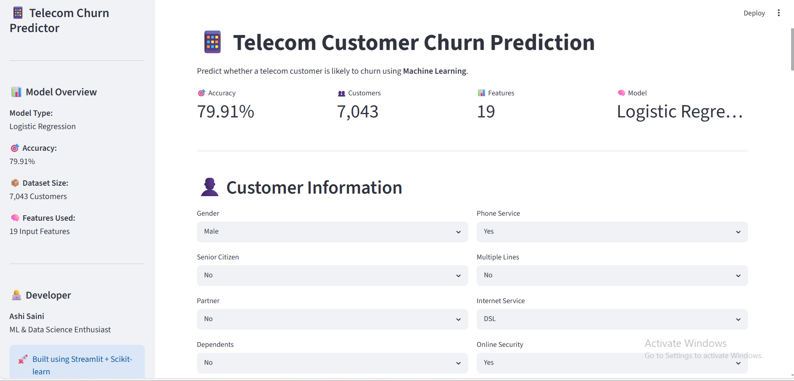
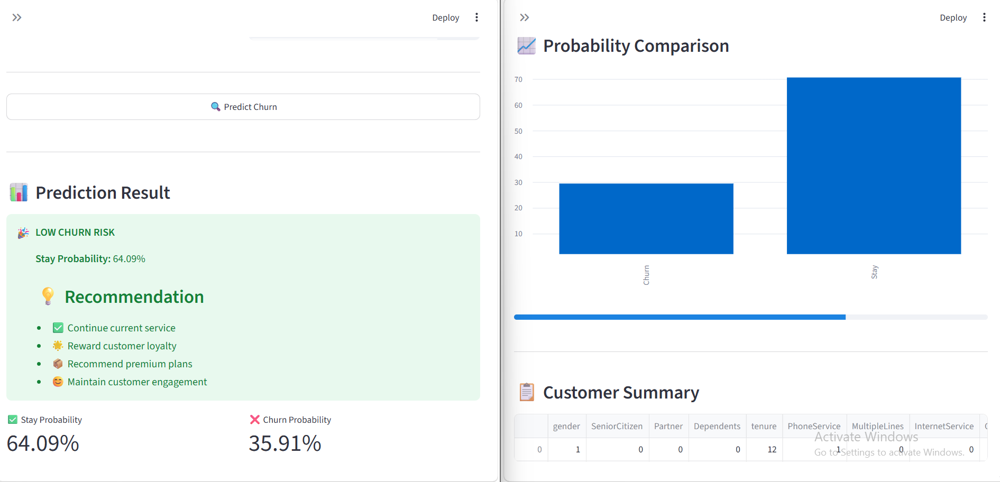
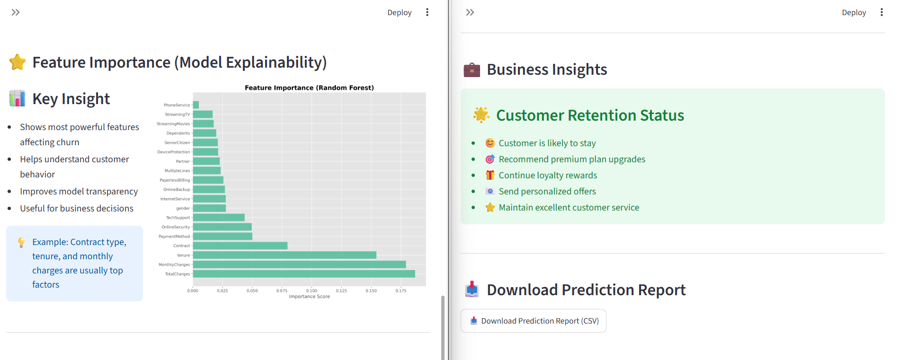

# 📱 Telecom Customer Churn Prediction

A Machine Learning web application that predicts whether a telecom customer is likely to churn based on customer demographics, subscription details, internet services, and billing information.

Built using **Python, Scikit-learn, and Streamlit**.

---

## 🚀 Live Demo

🔗 https://ml-telecom-customer-churn-prediction-ashi.streamlit.app/

---

# 📌 Project Overview

Customer churn is one of the biggest challenges faced by telecom companies.

This project uses a **Logistic Regression** model to predict the probability of customer churn and provides actionable business recommendations based on prediction results.

The application is designed for business users as well as data science learners, offering an intuitive interface and explainable predictions.

---

# ✨ Features

- 📊 Predict Customer Churn
- 📈 Stay vs Churn Probability
- 💡 Business Recommendations
- 📉 Probability Comparison Chart
- 📋 Customer Summary Table
- ⭐ Feature Importance Visualization
- 📥 Download Prediction as CSV
- 🎨 Professional Streamlit Dashboard

---

# 🧠 Machine Learning Pipeline

```
Raw Customer Data
        │
        ▼
Data Cleaning
        │
        ▼
Categorical Encoding
        │
        ▼
Feature Scaling
        │
        ▼
Logistic Regression Model
        │
        ▼
Prediction
        │
        ▼
Business Recommendations
```

---

# 📊 Model Information

| Item | Value |
|------|-------|
| Algorithm | Logistic Regression |
| Accuracy | **79.91%** |
| Dataset | IBM Telecom Customer Churn |
| Customers | 7,043 |
| Features | 19 |

---

# 🛠 Tech Stack

- Python
- Pandas
- NumPy
- Scikit-learn
- Streamlit
- Matplotlib
- Joblib

---

# 📂 Project Structure

```
Telecom-Customer-Churn-Prediction/

│
├── app.py
├── README.md
├── requirements.txt
│
├── data/
│
├── models/
│   ├── best_model.pkl
│   └── scaler.pkl
│
├── notebooks/
│
└── images/
    ├── dashboard.png
    ├── prediction.png
    ├── feature_importance.png
```

---

# 📷 Application Screenshots

## Dashboard



---

## Prediction Result



---

## Feature Importance



---

# 📈 Business Insights

The model identifies several important factors influencing customer churn.

### High Churn Indicators

- Month-to-month contracts
- Short customer tenure
- High monthly charges
- Electronic check payment method
- Lack of online security
- Lack of tech support

---

### Customer Retention Strategies

✅ Encourage long-term contracts

✅ Offer loyalty rewards

✅ Promote bundled internet services

✅ Provide proactive customer support

✅ Offer personalized discounts for high-risk customers

---

# 🎯 Business Value

This application helps telecom companies:

- Reduce customer churn
- Improve customer retention
- Increase revenue
- Support data-driven decisions
- Identify high-risk customers early

---

# ⚙️ Installation

Clone the repository

```bash
git clone https://github.com/yourusername/Telecom-Customer-Churn-Prediction.git
```

Move into project directory

```bash
cd Telecom-Customer-Churn-Prediction
```

Install dependencies

```bash
pip install -r requirements.txt
```

Run the application

```bash
streamlit run app.py
```

---

# 📊 Dataset

IBM Tel

# 👨‍💻 Developer

**Ashi Saini**

Intern I'D : CMQ1VFM0D0


⭐ If you like this project, don't forget to **Star** this repository!

Made with ❤️ by **Ashi Saini**

